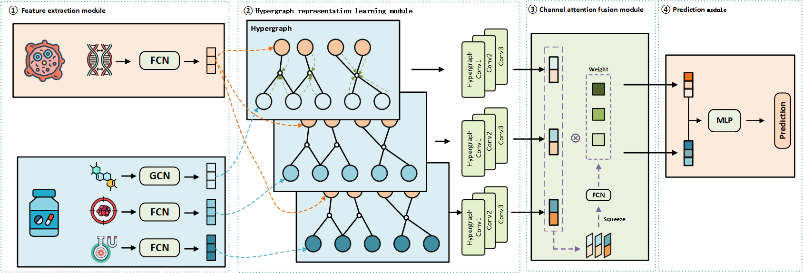

# MHGSynergy
This repository contains the code and data for "Multimodal hypergraph representation learning for drug synergy prediction"


# Requirements
* python 3.7
* deepchem >= 2.5
* numpy >= 1.19
* pandas >= 1.3
* pytorch >= 1.8.0
* pytorch geometric >= 2.0.0 
* scikit-learn >= 1.0.2
* rdkit >= 2020.09.1

# Usage
```sh
  cd Model/MHGSynergy
  # for classification experiment
  python main.py
  # for regression experiment
  python main_reg.py
```

# Contact
Author: Zheng Zhang  
Maintainer: Zheng Zhang  
Mail: m15629585255@163.com  
Date: 2024-9-10  
School of Biomedical Engineering, South-Central Minzu University, China  


# Other
This code framework is modified based on the HyperGraphSynergy method.  
Xuan Liu, Congzhi Song, Shichao Liu, Menglu Li, Xionghui Zhou, Wen Zhang, Multi-way relation-enhanced hypergraph representation learning for anti-cancer drug synergy prediction, Bioinformatics, Volume 38, Issue 20, 15 October 2022, Pages 4782–4789,  
https://doi.org/10.1093/bioinformatics/btac579